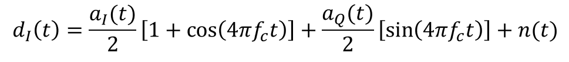
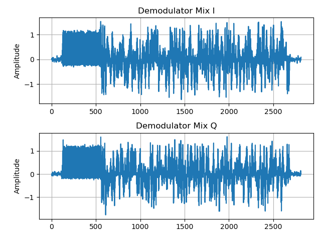
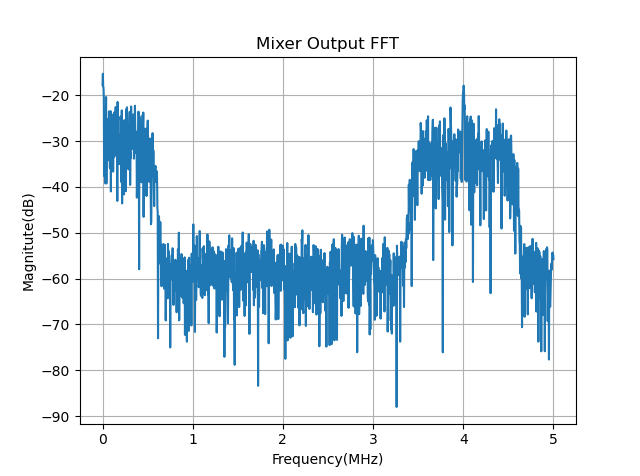
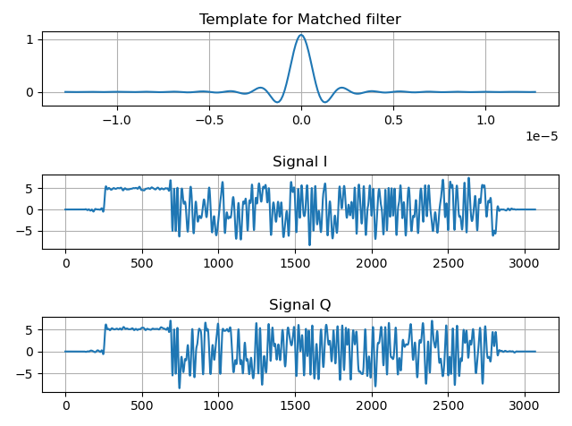
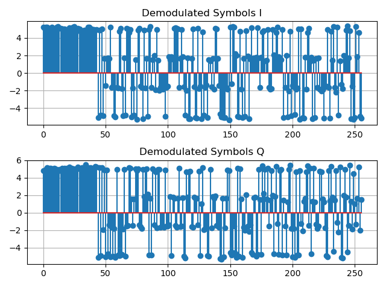
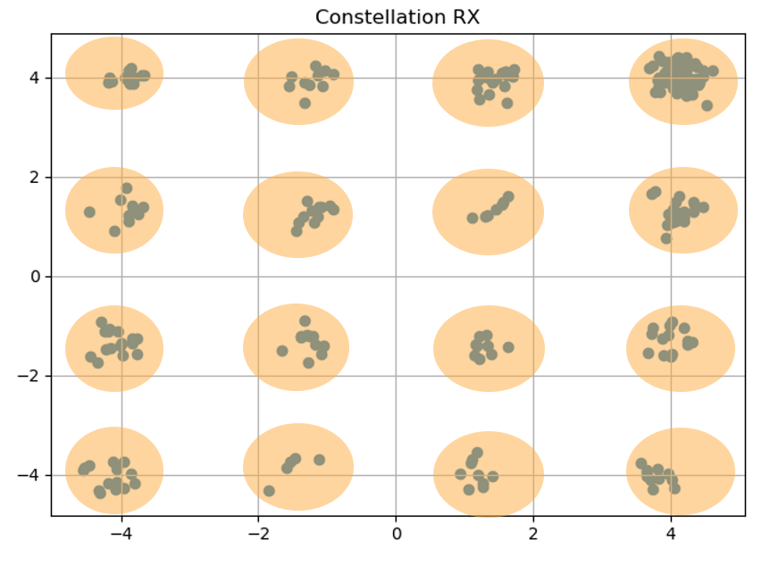
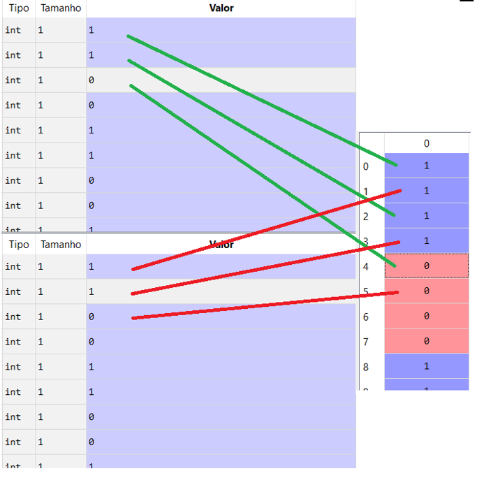

Demodulation
============
Module containing all the functions used in the demodulation process of a 16 QAM communication system.

Phase Locked Loop
*****************

.. automodule:: demodulation
   :members: PLL
   :undoc-members:
   :show-inheritance:
   :noindex:

.. code-block:: python

   import numpy as np
   import math

   def PLL(input_signal, Fs, length, N):
      zeta = .707  # damping factor
      k = 1
      Bn = 0.01 * Fs  # Noise Bandwidth
      K_0 = 1  # NCO gain
      K_d = 1/2  # Phase Detector gain
      K_p = (1 / (K_d * K_0)) * ((4 * zeta) / (zeta + (1 / (4 * zeta)))) * \
         (Bn / Fs)  # Proportional gain
      K_i = (1 / (K_d * K_0)) * (4 / (zeta + (1 / (4 * zeta)**2))) * \
         (Bn / Fs)**2  # Integrator gain
      integrator_out = 0
      phase_estimate = np.zeros(length)
      e_D = []  # phase-error output
      e_F = []  # loop filter output
      sin_out_n = np.zeros(length)
      cos_out_n = np.ones(length)
      for n in range(length - 1):
         # phase detector
         try:
               e_D.append(
                  math.atan(input_signal[n] * (cos_out_n[n] + sin_out_n[n])))
         except IndexError:
               e_D.append(0)
         # loop filter
         integrator_out += K_i * e_D[n]
         e_F.append(K_p * e_D[n] + integrator_out)
         # NCO
         try:
               phase_estimate[n + 1] = phase_estimate[n] + K_0 * e_F[n]
         except IndexError:
               phase_estimate[n + 1] = K_0 * e_F[n]
         sin_out_n[n + 1] = -np.sin(2 * np.pi * (k / N) * (n + 1) + phase_estimate[n])
         cos_out_n[n + 1] = np.cos(2 * np.pi * (k / N) * (n + 1) + phase_estimate[n])
         
      sin_out_n = -sin_out_n
      cos_out = cos_out_n[280:400]
      sin_out = sin_out_n[280:400]
      
      for i in range(18):
         cos_out = np.concatenate(
               (cos_out, cos_out_n[280:400], cos_out_n[280:400]), axis=None)
         sin_out = np.concatenate(
               (sin_out, sin_out_n[280:400], sin_out_n[280:400]), axis=None)
      return cos_out, sin_out

.. image:: images/PLL.png
   :width: 600
   :align: center

Image source: https://wirelesspi.com/phase-locked-loop-pll-in-a-software-defined-radio-sdr/

Mixer
*****

After the synchronization, the output of the PLL will mix the IF signal. 
Let's say s(t) is the IF signal and will be mixed by a cosine wave already synchronized.

s(t) is composed of the symbols in-phase (a_i) mixed with cosine and the symbols in quadrature (a_q) mixed with a sine.
Expanding s(t):

.. image:: images/eq_mixer_RX_2.png
   :width: 600
   :align: center

The mixing process will result in a baseband signal with high-frequency components:

Low Pass Filter
***************

Since the only thing that's important at this point is the baseband signal, an LPF will filter the high-frequency components.

.. automodule:: demodulation
   :members: LPF
   :undoc-members:
   :show-inheritance:
   :noindex:

.. code-block:: python

   import numpy as np
   import scipy.signal as sig

   def LPF(signal, fc, Fs):
      o = 5  # order of the filter
      fc = np.array([fc])
      wn = 2 * fc / Fs

      [b, a] = sig.butter(o, wn, btype='lowpass')
      [W, h] = sig.freqz(b, a, worN=1024)

      W = Fs * W / (2 * np.pi)

      signal_filt = sig.lfilter(b, a, signal)
      return signal_filt, W, h

.. image:: images/LPF.png
   :width: 600
   :align: center

Matched Filter
**************

.. automodule:: demodulation
   :members: matched_filter
   :undoc-members:
   :show-inheritance:
   :noindex:

.. code-block:: python
   
   import numpy as np

   def matched_filter(signal, template):
      signal_filt = np.convolve(signal, template, 'full')
      return signal_filt

Downsampler
***********

.. automodule:: demodulation
   :members: downsampler
   :undoc-members:
   :show-inheritance:
   :noindex:

.. code-block:: python

   def downsampler(signal, packet_s, upsampler_f):
      e = 0
      gardner_e = []
      peak_sample = 0
      peak_sample_acc = []
      low_point = 0
      threshold = 4
      for i in range(len(signal)):
         if signal[low_point] < -threshold:
               if signal[i] > threshold:
                  e = (abs(signal[(i + 1)]) -
                        abs(signal[i - 1])) * abs(signal[i])
                  gardner_e.append(e)
                  if e > 0.8:
                     peak_sample = peak_sample + 1
                     peak_sample_acc.append(peak_sample)
                  elif e < -0.8:
                     peak_sample = peak_sample - 1
                     peak_sample_acc.append(peak_sample)
                  else:
                     break
               else:
                  peak_sample = peak_sample + 1
                  peak_sample_acc.append(peak_sample)
         else:
               low_point = low_point + 1
               peak_sample = peak_sample + 1
               peak_sample_acc.append(peak_sample)

      # 450 is the number of samples before the convergence symbol of the algorithm.
      cut_i = peak_sample - 450
      cut_f = cut_i + int((packet_s / 4) * upsampler_f)
      print("Cut_i = ", cut_i)
      print("Cut_f = ", cut_f)

      # For the code to still work, even when there is a big BER, this secction is required.
      if cut_i > 730:
         signal = signal[261 : 2306 + 510]
      elif cut_i < 690:
         signal = signal[261 : 2306 + 510]
      else:
         signal = signal[cut_i:cut_f]

      symbols = signal[slice(0, len(signal), upsampler_f)]
      return symbols

.. image:: images/constellation_RX.png
   :width: 600
   :align: center

Demapper
********

.. automodule:: demodulation
   :members: demapper
   :undoc-members:
   :show-inheritance:
   :noindex:

.. code-block:: python

   import numpy as np

   def demapper(symbols_I, symbols_Q, packetSize, threshold = 3.0):
      Ns = packetSize // 4
      bits_I = []
      bits_Q = []
      for i in range(Ns):
         if symbols_I[i] >= 0 and symbols_I[i] <= threshold:
            bits_I.append(1)
            bits_I.append(0)

         if symbols_I[i] > threshold:
            bits_I.append(1)
            bits_I.append(1)

         if symbols_I[i] < 0 and symbols_I[i] >= -threshold:
            bits_I.append(0)
            bits_I.append(1)

         if symbols_I[i] < -threshold:
            bits_I.append(0)
            bits_I.append(0)

         if symbols_Q[i] >= 0 and symbols_Q[i] <= threshold:
            bits_Q.append(1)
            bits_Q.append(0)

         if symbols_Q[i] > threshold:
            bits_Q.append(1)
            bits_Q.append(1)

         if symbols_Q[i] < 0 and symbols_Q[i] >= -threshold:
            bits_Q.append(0)
            bits_Q.append(1)

         if symbols_Q[i] < -threshold:
            bits_Q.append(0)
            bits_Q.append(0)
         
      bits_I = np.array(bits_I, dtype=int)
      bits_Q = np.array(bits_Q, dtype=int)

      bitStream = np.zeros(packetSize, dtype=int)

      bitStream[::2] = bits_I
      bitStream[1::2] = bits_Q

      return bitStream

