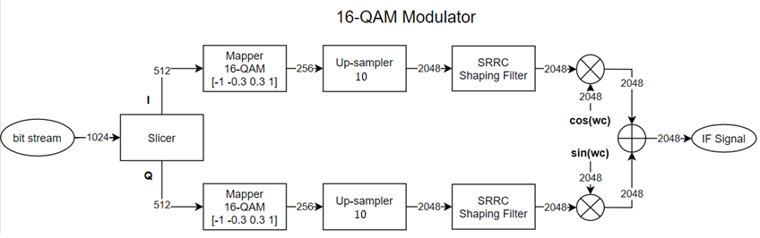
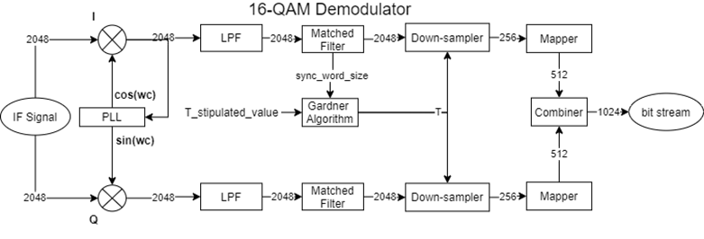

Example
========

This example demonstrates the implementation of a 16-QAM communication system.
       Link: https://youtu.be/vZQu4YDwEKc

The code follows the block diagram below:

.. code-block:: python

   import qamfunctions.modulation
   import qamfunctions.demodulation
   import qamfunctions.channel
   import qamfunctions as qf
   import matplotlib.pyplot as plt
   import numpy as np
   from math import pi
   import scipy.fftpack as sf

   plt.close('all')

   def QAMsys(SNR, plot=1):
      """16QAM system.

      Args:
         SNR (float): Signal to Noise Ratio (dB)
         plot (int, optional): If it's set to 1 the graphics will be plotted, if it's set to 0 there will be no plots. Default: 1.

         output (float): Bit error rate (BER).
      """
      # Upsampler Factor
      K = 10

      # Number of symbols
      Ns = 256

      # Roll-off factor
      alpha = 0.3

      # Bits per symbol
      Bs = 4

      # 16QAM Constellation vector
      QAM16 = [-1, -0.333, 0.333, 1]

      # Intermediary frequency
      Fif = 2e6

      # Sampling Rate
      Fs = Fif*K/2

      # Pseudo-Rand Generator with synchronization bits

      data = qf.modulation.data_gen(Ns*Bs)
      if plot == 1:
         plt.figure(0)
         plt.stem(data)
         plt.title('Data')
         plt.grid()

      # Slicer

      (dataI, dataQ) = qf.modulation.slicer(data)

      # Mapper

      mapI = qf.modulation.mapper_16QAM(QAM16, dataI)
      mapQ = qf.modulation.mapper_16QAM(QAM16, dataQ)

      if plot == 1:
         plt.figure(1)
         plt.subplot(2, 1, 1)
         plt.stem(mapI)
         plt.title('Mapper I')
         plt.grid()
         plt.subplot(2, 1, 2)
         plt.stem(mapQ)
         plt.title('Mapper Q')
         plt.tight_layout()
         plt.grid()

         plt.figure(2)
         plt.scatter(mapI, mapQ)
         plt.title('Constelation IQ out mapper')
         plt.xlabel('In-Phase')
         plt.ylabel('Quadrature')
         plt.tight_layout()
         plt.grid()

      # Up-sampler

      upI = qf.modulation.upsampler(Ns, K, mapI)
      upQ = qf.modulation.upsampler(Ns, K, mapQ)

      if plot == 1:
         plt.figure(3)
         plt.subplot(2, 1, 1)
         plt.stem(upI)
         plt.grid()
         plt.title('Up-Sampler I')
         plt.subplot(2, 1, 2)
         plt.stem(upQ)
         plt.title('Up-Sampler Q')
         plt.tight_layout()
         plt.grid()

      # Shaping filter

      [shape_I, a, b] = qf.modulation.shaping_filter(upI, Ns, alpha, Fif, Fs)
      [shape_Q, a, b] = qf.modulation.shaping_filter(upQ, Ns, alpha, Fif, Fs)

      template = b
      
      if plot == 1:
         plt.figure(4)
         plt.plot(a, b)
         plt.title('SRRC Filter Impulse Response')
         plt.grid()
         plt.figure(5)
         plt.subplot(3, 1, 1)
         plt.plot(shape_I)
         plt.title('Raised Cosine Filter Convolution I')
         plt.grid()
         plt.subplot(3, 1, 2)
         plt.plot(shape_Q)
         plt.title('Raised Cosine Filter Convolution Q')
         plt.grid()
         plt.subplot(3, 1, 3)
         plt.plot(shape_I, shape_Q)
         plt.title('Constalation IQ filter output')
         plt.tight_layout()
         plt.grid()

      # Comparison between the FFT of the Upsampler output and Shaping Filter output.

      if plot == 1:
         X_f = abs(sf.fft(upI))
         l = np.size(upI)
         fr = (Fs/2)*np.linspace(0, 1, int(l/2))
         xl_m = (2/l)*abs(X_f[0:np.size(fr)])

         plt.figure(6)
         plt.subplot(2, 1, 1)
         plt.plot(fr/1e6, 20*np.log10(xl_m))
         plt.title('Upsampler Output Spectrum')
         plt.xlabel('Frequency(MHz)')
         plt.ylabel('Magnitute(dB)')
         plt.grid()
         plt.tight_layout()

         X_f2 = abs(sf.fft(shape_I))
         l2 = np.size(shape_I)
         fr2 = (Fs/2)*np.linspace(0, 1, int(l2/2))
         xl_m2 = (2/l2)*abs(X_f2[0:np.size(fr2)])

         plt.subplot(2, 1, 2)
         plt.plot(fr2/1e6, 20*np.log10(xl_m2))
         plt.title('Shaping Filter Output Spectrum')
         plt.xlabel('Frequency(MHz)')
         plt.ylabel('Magnitute(dB)')
         plt.grid()
         plt.tight_layout()

      # Oscillator

      delta_phase = np.random.normal(0, pi/3, 1)
      delta_freq = np.random.normal(0, 20, 1)

      (loCos_TX, t) = qf.modulation.oscillator(0, 4e-4, 2 /
                                    (Fif*K),  Fif + delta_freq, delta_phase + pi/2)
      (loSin_TX, t) = qf.modulation.oscillator(0, 4e-4, 2 /
                                    (Fif*K),  Fif + delta_freq, delta_phase)

      if plot == 1:
         X_f_1 = abs(sf.fft(loCos_TX))
         l_1 = np.size(loCos_TX)
         fr_1 = (Fs/2)*np.linspace(0, 1, int(l_1/2))
         xl_m_1 = (2/l_1)*abs(X_f_1[0:np.size(fr_1)])

         plt.figure(7)
         plt.subplot(2, 1, 1)
         plt.plot(fr_1/1e6, 20*np.log10(xl_m_1))
         plt.title('Spectrum of local oscilator')
         plt.xlabel('Frequency(MHz)')
         plt.ylabel('Magnitute(dB)')
         plt.grid()

         plt.subplot(2, 1, 2)
         plt.plot(t, loCos_TX)
         plt.title('Local Cos')
         plt.xlabel('t(s)')
         plt.ylabel('Amplitude')
         plt.tight_layout()
         plt.grid()

      # Mixers

      mixI = qf.modulation.mixer(shape_I, loCos_TX)
      mixQ = qf.modulation.mixer(shape_Q,loSin_TX)

      if plot == 1:
         plt.figure(8)
         plt.subplot(3, 1, 1)
         plt.plot(mixI)
         plt.title('Mix I')
         plt.ylabel('Amplitude')
         plt.tight_layout()
         plt.grid()

         plt.subplot(3, 1, 2)
         plt.plot(mixQ)
         plt.title('Mix Q')
         plt.ylabel('Amplitude')
         plt.tight_layout()
         plt.grid()

      # Combiner

      IF = qf.modulation.combiner(mixI, mixQ)

      # Noise

      IF_n = qf.channel.AWGN(IF, SNR)

      if plot == 1:
         plt.subplot(3, 1, 3)
         plt.plot(IF_n)
         plt.title('Mix IQ')
         plt.ylabel('Amplitude')
         plt.tight_layout()
         plt.grid()

         X_f1 = abs(sf.fft(IF_n))
         l1 = np.size(IF_n)
         fr1 = (Fs/2)*np.linspace(0, 1, int(l1/2))
         xl_m1 = (2/l1)*abs(X_f1[0:np.size(fr1)])

         plt.figure(9)
         plt.plot(fr1/1e6, 20*np.log10(xl_m1))
         plt.title('IF Spectrum')
         plt.xlabel('Frequency(MHz)')
         plt.ylabel('Magnitute(dB)')
         plt.tight_layout()
         plt.grid()

      # Synchronization

      (loCos_RX, loSin_RX) = qf.demodulation.PLL(IF_n, Fs, len(loCos_TX), K/2)

      if plot == 1:
         plt.figure(10)
         plt.plot(IF_n)
         plt.title('Mixed Signal')
         plt.xlabel('Samples')
         plt.ylabel('Amplitude')

         plt.figure(11)
         plt.subplot(2, 1, 1)
         plt.plot(loCos_RX)
         plt.plot(loCos_TX)
         plt.title("TX and RX Cos")
         plt.subplot(2, 1, 2)
         plt.plot(loSin_RX)
         plt.plot(loSin_TX)
         plt.title("TX and RX Sin")

      # Mixer

      shape_I_demod = qf.modulation.mixer(IF_n, loCos_RX)
      shape_Q_demod = qf.modulation.mixer(IF_n, loSin_RX)

      if plot == 1:
         plt.figure(12)
         plt.subplot(2, 1, 1)
         plt.plot(shape_I_demod)
         plt.title('Demodulator Mix I')
         plt.ylabel('Amplitude')
         plt.tight_layout()
         plt.grid()

         plt.subplot(2, 1, 2)
         plt.plot(shape_Q_demod)
         plt.title('Demodulator Mix Q')
         plt.ylabel('Amplitude')
         plt.tight_layout()
         plt.grid()

         X_f3 = abs(sf.fft(shape_I_demod))
         l3 = np.size(shape_I_demod)
         fr3 = (Fs/2)*np.linspace(0, 1, int(l3/2))
         xl_m3 = (2/l3)*abs(X_f3[0:np.size(fr3)])

         plt.figure(13)
         plt.plot(fr3/1e6, 20*np.log10(xl_m3))
         plt.title('Demodulator Mixer Output')
         plt.xlabel('Frequency(MHz)')
         plt.ylabel('Magnitute(dB)')
         plt.grid()

      # Low Pass Filter (Butterworth)

      fc = 1e6

      [shape_I_demod_filt, W, h] = qf.demodulation.LPF(shape_I_demod, fc, Fs)
      [shape_Q_demod_filt, W, h] = qf.demodulation.LPF(shape_Q_demod, fc, Fs)
      
      if plot == 1:
         plt.figure(14)
         plt.subplot(3, 1, 1)
         plt.plot(W, 20*np.log10(h))
         plt.title('Filter Freq. Response')
         plt.xlabel('Frequency(Hz)')
         plt.ylabel('Magnitute(dB)')
         plt.grid()

         plt.subplot(3, 1, 2)
         plt.plot(shape_I_demod_filt)
         plt.title('Filtered Signal I')
         plt.tight_layout()
         plt.ylabel('Amplitude')
         plt.grid()

         plt.subplot(3, 1, 3)
         plt.plot(shape_Q_demod_filt)
         plt.title('Filtered Signal Q')
         plt.tight_layout()
         plt.ylabel('Amplitude')
         plt.grid()

      # Matched Filter

      signal_I = qf.demodulation.matched_filter(shape_I_demod_filt, template)
      signal_Q = qf.demodulation.matched_filter(shape_Q_demod_filt, template)
      

      if plot == 1:
         plt.figure(15)
         plt.subplot(3, 1, 1)
         plt.plot(a,template)
         plt.title('Template for Matched filter')
         plt.tight_layout()
         plt.grid()

         plt.subplot(3, 1, 2)
         plt.plot(signal_I)
         plt.title('Signal I')
         plt.tight_layout()
         plt.grid()

         plt.subplot(3, 1, 3)
         plt.plot(signal_Q)
         plt.title('Signal Q')
         plt.tight_layout()
         plt.grid()

      # Sampling - Gardner Algorithm

      symbols_I = qf.demodulation.downsampler(signal_I, len(data), K)
      symbols_Q = qf.demodulation.downsampler(signal_Q, len(data), K)

      if plot == 1:
         plt.figure(16)
         plt.subplot(2, 1, 1)
         plt.stem(symbols_I)
         plt.title('Demodulated Simbols I')
         plt.grid()
         plt.subplot(2, 1, 2)
         plt.stem(symbols_Q)
         plt.title('Demodulated Simbols Q')
         plt.grid()
         plt.tight_layout()

         plt.figure(17)
         plt.scatter(mapI, mapQ)
         plt.title('Constelation TX')
         plt.grid()
         plt.figure(18)
         plt.scatter(symbols_I, symbols_Q)
         plt.title('Constelation RX')
         plt.grid()
         plt.tight_layout()

      # Demapper

      data_demod = qf.demodulation.demapper(symbols_I, symbols_Q, len(data))
      
      error = 0.0

      for i in range(len(data)):
         if data_demod[i] != data[i]:
               error = error + 1.0

      BER = (error*100)/(len(data))

      print("\n\n\n")

      print("BER:", BER, "%")

      print("Phase Offset Through AWGN Channel:", delta_phase/pi, "pi rad")
      print("Frequency Offset AWGN Channel:", delta_freq, "Hz")

      print("\n\n\n")

      return(BER/100)
