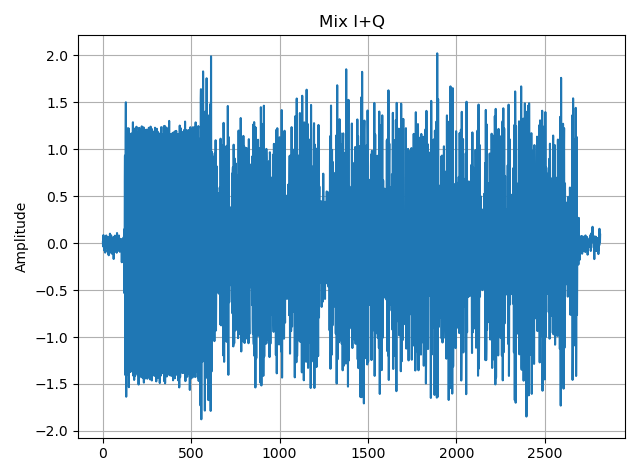

Modulation
==========
Module containing all the functions used in the modulation process of a 16 QAM communication system.

Data Generator
**************

.. automodule:: modulation
   :members: data_gen
   :undoc-members:
   :show-inheritance:
   :noindex:

.. code-block:: python

   import numpy as np

   def data_gen(N, data_sync=0):
    if data_sync == 0:
        data_sync_osc = np.ones(176, dtype=int)
        data_sync_symb = [0, 0, 0, 0, 1, 1, 1, 1, 0, 0, 0, 0, 1, 1, 1, 1]  
        data_sync = np.concatenate((data_sync_osc, data_sync_symb), axis=None)
    data_r = np.random.randint(2, size=N - len(data_sync))
    data = np.concatenate((data_sync, data_r))
    return data

Slicer
**************

.. automodule:: modulation
   :members: slicer
   :undoc-members:
   :show-inheritance:
   :noindex:

.. code-block:: python

   def slicer(data): 
      dataI = data[slice(0, len(data), 2)]
      dataQ = data[slice(1, len(data), 2)]
      return(dataI, dataQ)

.. image:: images/slicer.png
   :width: 600
   :align: center

Mapper
**************

.. automodule:: modulation
   :members: mapper_16QAM
   :undoc-members:
   :show-inheritance:
   :noindex:

.. code-block:: python

   def mapper_16QAM(QAM16, data):    
    map_indices = 2 * data[:-1:2] + data[1::2]
    dataMapped = np.take(QAM16, map_indices)
    return dataMapped

.. image:: images/constellation.png
   :width: 600
   :align: center

Upsampler
**************

.. automodule:: modulation
   :members: upsampler
   :undoc-members:
   :show-inheritance:
   :noindex:

.. code-block:: python

   import numpy as np

   def upsampler(Ns, K, symbols):  
      up = np.zeros(Ns * K)
      up[::K] = symbols
      return up

Shaping Filter
**************

.. automodule:: modulation
   :members: shaping_filter
   :undoc-members:
   :show-inheritance:
   :noindex:

.. code-block:: python

   import numpy as np
   import commpy as cp

   def shaping_filter(upsampler, Ns, alpha, Fif, Fs):
      [x_axis, y_response] = cp.rrcosfilter(Ns, alpha, 2 / Fif, Fs)
      shaped_signal = np.convolve(upsampler, y_response, 'full')
      return shaped_signal, x_axis, y_response
   
.. image:: images/impulse_response.png
   :width: 600
   :align: center

Oscillator
**************

.. automodule:: modulation
   :members: oscillator
   :undoc-members:
   :show-inheritance:
   :noindex:

.. code-block:: python

   import numpy as np
   
   def oscillator(start, stop, step, frequency, phase=0):
      t = np.arange(start, stop, step)
      Osc = np.sin(2 * np.pi * frequency * t + phase)
      return Osc, t

Mixer
**************

.. automodule:: modulation
   :members: mixer
   :undoc-members:
   :show-inheritance:
   :noindex:

.. code-block:: python
   
   import numpy as np

   def mixer(signal, carrier):
      return np.multiply(signal, carrier[0 : len(signal)])

.. image:: images/mixer.png
   :width: 600
   :align: center

Combiner
**************

.. automodule:: modulation
   :members: combiner
   :undoc-members:
   :show-inheritance:
   :noindex:

.. code-block:: python

   import numpy as np

   def combiner(signal_I, signal_Q):
      return np.add(signal_I, signal_Q)
   
